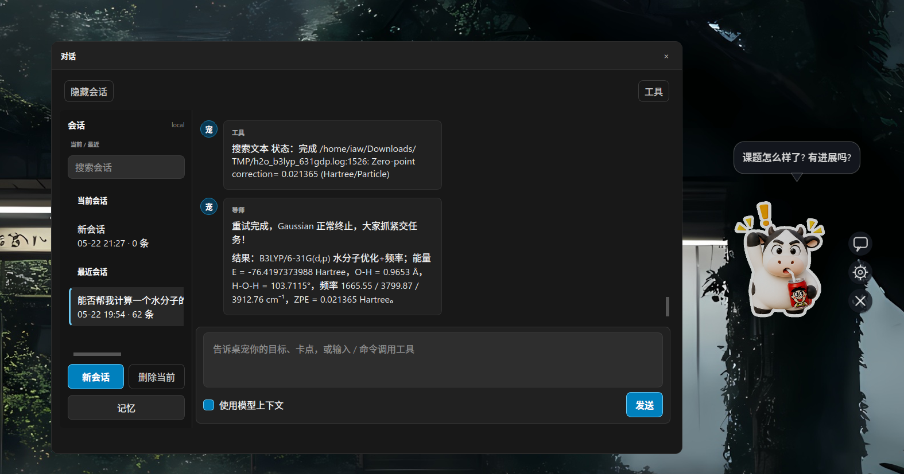

# 我的桌面导师

PySide6 桌面导师 / 桌宠应用。它常驻桌面，提供对话、提醒、文件上下文、长期记忆，以及需要用户授权的本机工具操作。



## 当前能力

- 桌宠贴纸：透明置顶、鼠标/触屏拖动、右键菜单、系统托盘和快捷按钮。
- 动作动画：内置 `idle`、`tap`、`drag`、`thinking`、`speaking`、`alert`、`drop_file`、`error` 八类贴纸。
- 多会话对话：本地保存多个会话，支持搜索、切换、新建和删除当前会话。
- Agent 对话：兼容 OpenAI Chat Completions 接口，支持 function tool calls 和工具结果回传后的 agent loop。
- 基础工具：系统信息、目录列表、路径检查、读文件、搜索、打开路径、运行命令、创建目录、创建文件、覆盖写入和追加写入。
- Skill 扩展：稳定工作流放在 `SKILL.md` 中，按用户输入匹配后注入上下文；skill 只指导如何组合基础工具，不新增专用 function。
- 长期记忆：用户级偏好和约束保存在本机 `user_memory.json`，可在对话窗口的 `记忆` 入口中查看、编辑、停用和删除。
- 富文本显示：助手回复支持 Markdown、代码块、表格、图片和 LaTeX 公式；短回复使用紧凑气泡，代码/表格/公式等内容自动使用宽布局。
- 桌面辅助：待办提醒、文件/文件夹拖放上下文、可配置形象、语气和动作贴纸。

## 安装

要求：

- Conda / Miniconda / Anaconda
- Python 3.11+
- PySide6 6.5+
- `qasync`

Linux 推荐使用用户级安装脚本。默认创建或复用名为 `my-desktop-mentor` 的 Conda 环境，并写入当前用户的桌面启动器：

```bash
bash install_linux.sh
```

常用选项：

```bash
bash install_linux.sh --conda /path/to/conda
bash install_linux.sh --env-name my-desktop-mentor
bash install_linux.sh --env-prefix "$PWD/.conda"
bash install_linux.sh --python-version 3.12
bash install_linux.sh --input-method auto
bash install_linux.sh --qt-platform auto
bash install_linux.sh --no-deps
bash install_linux.sh --dry-run
```

安装脚本会自动探测输入法和桌面环境，再生成 `.desktop` 文件：

- 输入法：`auto`、`fcitx`、`ibus`、`none`
- Qt 平台：`auto`、`xcb`、`wayland`、`none`
- 环境：默认命名环境 `my-desktop-mentor`；也可用 `--env-prefix` 显式指定路径环境

只安装或修复 Conda 依赖：

```bash
./scripts/linux/setup_conda_env.sh
```

手动创建环境：

```bash
conda create -n my-desktop-mentor python=3.12 pip
conda run -n my-desktop-mentor python -m pip install -r requirements.txt
conda activate my-desktop-mentor
```

## 卸载

默认只移除当前用户的桌面启动器，不删除配置、会话、长期记忆、日志或 Conda 环境：

```bash
bash uninstall_linux.sh
```

需要彻底清理时显式加参数：

```bash
bash uninstall_linux.sh --remove-config
bash uninstall_linux.sh --remove-env --env-name my-desktop-mentor
bash uninstall_linux.sh --remove-env --env-prefix "$PWD/.conda"
bash uninstall_linux.sh --dry-run
```

## 启动

源码启动：

```bash
./scripts/linux/run_desktop_mentor.sh
```

指定 Python：

```bash
DESKTOP_MENTOR_PYTHON=/usr/bin/python3 ./scripts/linux/run_desktop_mentor.sh
```

指定命名 Conda 环境：

```bash
DESKTOP_MENTOR_CONDA_ENV_NAME=my-desktop-mentor ./scripts/linux/run_desktop_mentor.sh
```

指定 Conda 环境路径：

```bash
DESKTOP_MENTOR_CONDA_PREFIX="$PWD/.conda" ./scripts/linux/run_desktop_mentor.sh
```

诊断：

```bash
./scripts/linux/run_desktop_mentor.sh --diagnose --self-test
./scripts/linux/self_test.sh
```

安装后的桌面启动器通常位于：

```text
~/.local/share/applications/desktop_mentor.desktop
```

如果 rofi 或桌面菜单中找不到，先检查：

```bash
desktop-file-validate ~/.local/share/applications/desktop_mentor.desktop
gtk-launch desktop_mentor
```

## Windows

安装依赖：

```bat
scripts\windows\setup_conda_env.bat
```

源码运行：

```bat
scripts\windows\run_desktop_mentor.bat
```

无控制台启动：

```bat
scripts\windows\run_desktop_mentor_quiet.vbs
```

打包 exe：

```bat
scripts\windows\build_windows_exe.bat
```

更多说明见 [docs/WINDOWS.md](docs/WINDOWS.md)。

## 基本使用

桌宠右侧快捷按钮：

- `对话`：打开 agent 对话窗口。
- `设置`：配置模型、工作目录、记忆、工具权限、贴纸和话术。
- `退出`：关闭应用。

右键桌宠或系统托盘可以打开设置、待办、文件摘要、显示/隐藏桌宠，或把桌宠移回右下角。

对话窗口：

- 输入框按 Enter 发送，Shift+Enter 换行。
- `使用模型上下文` 决定本次请求是否携带当前会话、agent 状态和长期记忆。
- `记忆` 打开长期记忆管理器。
- `删除当前` 会删除当前本地会话文件并从会话列表移除。
- 请求处理中可点 `取消`。

设置页常用项：

- `Agent URL`
- `API Key`
- `Model`
- `Config directory`
- `Pet image`
- `Action stickers`
- `模型上下文`
- `Computer control`
- `Workspace`
- `Style prompt`

## Agent、工具和 Skill

模型请求使用 OpenAI-compatible Chat Completions 格式。启用电脑控制后，应用会把基础工具注册为 function tools；模型返回 tool call 后，应用执行工具，把结果作为 `tool` 消息回传给模型，再由模型继续生成最终回复。

只读工具会直接执行并进入 agent loop。打开路径、运行命令、创建目录、创建文件、写入和追加写入会先在对话中生成授权卡，点击 `允许本次` 后才执行。

本地基础工具包括：

```text
system_info
list_dir
path_info
read_file
search_text
open_path
run_command
make_dir
touch_file
write_file
append_file
```

内置命令入口：

```text
/sys 或 /pwd
/ls [路径]
/stat <路径>
/read <路径>
/search <关键词> [路径]
/open <路径或URL>
/run [--cwd 路径] <命令 参数...>
/mkdir <路径>
/touch <路径>
/write <路径> :: <内容>
/append <路径> :: <内容>
```

Skill 文件位置：

```text
desktop_mentor_app/skills/*/SKILL.md
<配置目录>/skills/*/SKILL.md
```

例如 Gaussian 这类领域流程不做成专用 function，而是用 skill 指导 agent 组合基础工具、写输入文件、运行命令和检查结果。

安全边界：

- 不提供删除文件工具。
- 不执行 `cmd /c`、`powershell -Command`、`sh -c` 这类 shell 字符串命令。
- 包含 token、secret、password、credential、SSH 私钥等敏感名称的路径会被阻止。
- `Workspace` 是工具默认工作目录，也是模型创建任务文件的默认落点；应用安装目录不应作为计算或生成文件目录。

## 会话、记忆和本地状态

本地会话历史、模型上下文和长期记忆是三套机制：

- 本地会话历史：保存多个聊天会话，位于 `conversations/`。
- 模型上下文：决定本次请求是否携带当前会话摘要、最近消息、agent 状态和长期记忆。
- 长期记忆：保存用户级偏好和约束，位于 `user_memory.json`。

Agent 状态单独保存在 `agent_state.sqlite3`，用于记录任务运行、工具证据和待确认的记忆候选。它不替代聊天记录，而是帮助后续请求恢复“上次任务做到哪一步”和“哪些工具结果已经发生过”。

## 配置和运行时文件

运行时配置默认保存在用户配置目录，不写入项目目录：

- Linux: `~/.config/my-desktop-mentor/`
- Windows: `%APPDATA%\MyDesktopMentor\`
- macOS: `~/Library/Application Support/MyDesktopMentor/`

主要文件：

```text
config.json
conversations/
agent_state.sqlite3
memory.jsonl
user_memory.json
todos.json
control/audit.jsonl
logs/app.log
```

覆盖配置路径：

```bash
DESKTOP_MENTOR_CONFIG=/path/to/config.json ./scripts/linux/run_desktop_mentor.sh
DESKTOP_MENTOR_CONFIG_DIR=/path/to/config-dir ./scripts/linux/run_desktop_mentor.sh
```

旧版 `config.json` 首次加载时会自动迁移到当前 schema，并在同目录生成备份。

## 贴纸素材

默认素材：

```text
assets/stickers/
```

自定义素材目录格式：

```text
stickers/
  idle/*.png
  tap/*.png
  drag/*.png
  thinking/*.png
  speaking/*.png
  alert/*.png
  drop_file/*.png
  error/*.png
```

命令行导入：

```bash
python3 desktop_mentor.py --load-sticker-dir /path/to/stickers
```

## 开发和测试

主要入口：

```text
desktop_mentor.py
scripts/linux/run_desktop_mentor.sh
scripts/linux/self_test.sh
```

核心目录：

- `config/`、`state/`：配置迁移、本地会话、长期记忆、待办和 agent 状态。
- `model_client/`：OpenAI-compatible 模型客户端、tool call 解析和消息组装。
- `tools/`、`security/`：基础工具、命令解析、执行器和权限策略。
- `agent/`：模型上下文组装和本地 skill 匹配。
- `pet/`：对话服务、动画、贴纸、idle 和待办逻辑。
- `ui/`：Qt 对话框、Markdown 渲染、主题和桌宠交互。

常用检查：

```bash
python3 -m unittest discover -s tests
git diff --check
bash -n install_linux.sh uninstall_linux.sh scripts/linux/*.sh
```
